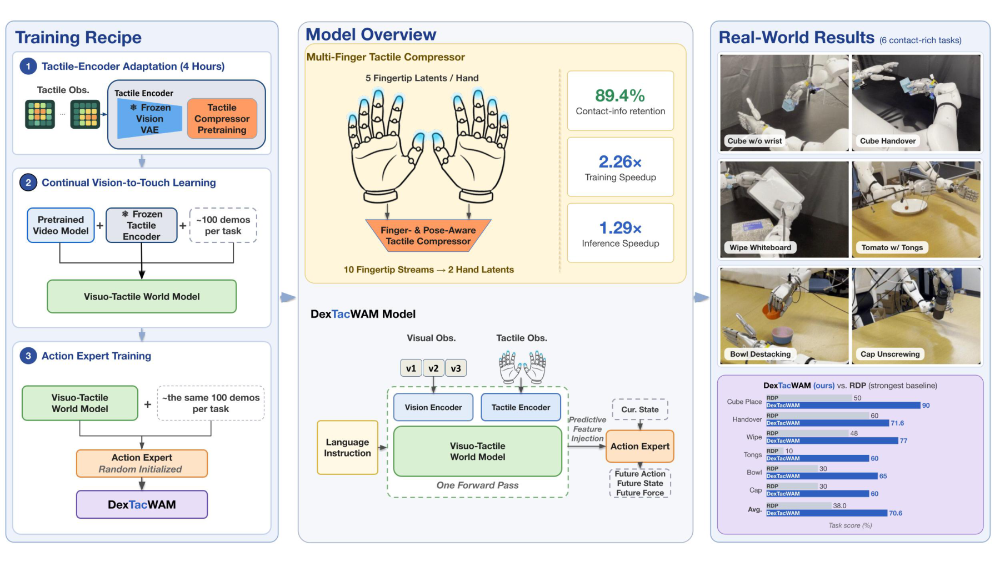
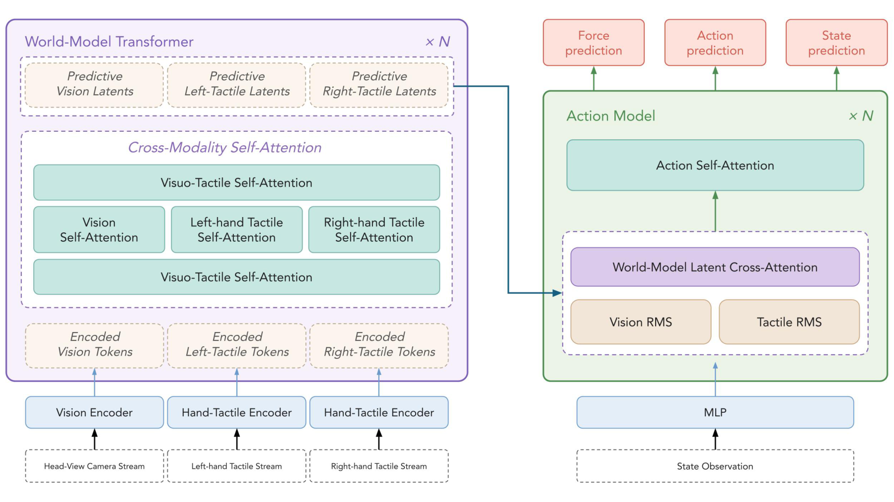

<div align="center">

# [DexTacWAM: A Visuo-Tactile World-Action Model for Dexterous Manipulation](https://dextacwam.github.io/)

[Haoran Yuan](https://scholar.google.com/citations?user=PzdigUMAAAAJ)<sup>1,&ast;,‡</sup> &nbsp;
[Zekai Wang](https://scholar.google.com/citations?user=Dngm3CYAAAAJ)<sup>2</sup> &nbsp;
[Boning Shao](https://scholar.google.com/citations?user=tlOWnSIAAAAJ)<sup>2</sup> &nbsp;
[Haoran Lu](https://luhr2003.github.io/)<sup>3,&ast;</sup> &nbsp;
[Trevor Darrell](https://people.eecs.berkeley.edu/~trevor/)<sup>2</sup> &nbsp;
[Ismini Lourentzou](https://isminoula.github.io/)<sup>1,†</sup> &nbsp;
[Wei Zhan](https://scholar.google.com/citations?user=xVN3UxYAAAAJ)<sup>2,†</sup>

<sup>1</sup>University of Illinois Urbana-Champaign &nbsp;
<sup>2</sup>University of California, Berkeley &nbsp;
<sup>3</sup>Northwestern University

<sup>&ast;</sup>Work done during a visit to UC Berkeley

<sup>‡</sup>Project lead &nbsp;&nbsp; <sup>†</sup>Equal advising, co-corresponding authors

[](https://arxiv.org/abs/2609.24976)
[](https://dextacwam.github.io/)
[](https://huggingface.co/collections/JensenYuan/dextacwam-6aba3aa25d3362d882cdefbc)
[](LICENSE)

</div>



## Overview

Dexterous manipulation depends on contact dynamics that are often only partially
observable from vision. Recent World-Action Models couple predictive video world
modeling with action generation, but remain largely vision-centric and therefore
cannot directly model these contact dynamics.

DexTacWAM is a visuo-tactile World-Action Model that encodes each fingertip
independently, aggregates the resulting features through a finger- and
pose-aware tactile compressor, and injects the tactile latent into a video
diffusion world model for joint visuo-tactile world modeling. Across six
contact-rich tasks on a 22-DoF bimanual platform it averages **70.6** against
**38.0** for the strongest baseline.

The compressor is what makes that affordable: it reduces ten fingertip streams
to two hand-level latents, retaining 89.4% of pre-fusion contact recall while
training 2.26x faster and running inference 1.29x faster.

## Release

- Full training and inference code for all three stages
- Configs for the six real-robot tasks and the ablations
- The 488-episode tactile pretraining corpus
- Roughly 100 demonstrations for each of the six evaluation tasks
- The pretrained stage 1 multi-finger tactile encoder
- Real-robot deployment and evaluation code

Not included: stage 2 world models and stage 3 action experts. Those are cheap
to train from what is here and carry no information the configs do not — see
[Checkpoints and data](#checkpoints-and-data).

## Repository layout

```
models/tactile_models/   tactile encoder, compressor and projector
runner/                  three-stage trainers and the inferencer
data/                    datasets, caching and the layout contract
configs/                 the 16 configs behind the paper results
tests/                   unit and smoke tests
```

DexTacWAM builds on [Genie-Envisioner](https://github.com/AgibotTech/Genie-Envisioner-V1)
at commit `d54425c4`; that code is included here and the files we modified are
listed in [NOTICE](NOTICE).

## Installation

```bash
git clone https://github.com/dextacwam/DexTacWAM.git
cd DexTacWAM
pip install -r requirements.txt
```

The released configs were developed and tested on 4x H200 NVL. Stage 1 fits on
a single GPU; stages 2 and 3 were run with distributed multi-GPU training, and
the batch sizes in the configs assume it.

Then fetch the three sets of weights the configs expect. Ours first:

```bash
hf download JensenYuan/DexTacWAM_multi_finger_tactile_encoder \
    --local-dir pretrained_models/dextacwam_tactile_encoder
```

Then the upstream backbone from Genie-Envisioner, and the LTX-Video VAE,
tokenizer and text encoder it is built on:

```bash
hf download agibot-world/Genie-Envisioner-v1.0 GE_base_fast_v0.1.safetensors \
    --local-dir pretrained_models/genie_envisioner

hf download Lightricks/LTX-Video --local-dir pretrained_models/ltx_video \
    --include "model_index.json" "vae/*" "tokenizer/*" "text_encoder/*"
```

The `--include` filter is deliberate: post-training needs only those four
pieces, not the full LTX-Video checkpoint. The result should look like this:

```
pretrained_models/ltx_video/{model_index.json,vae/,tokenizer/,text_encoder/}
pretrained_models/genie_envisioner/GE_base_fast_v0.1.safetensors
pretrained_models/dextacwam_tactile_encoder/model.pt
```

`GE_base_fast_v0.1.safetensors` is distributed under the LTX-Video Open Weights
License rather than Apache 2.0; check that it permits your use.

## Checkpoints and data

All released checkpoints and datasets live in the
[DexTacWAM collection on HuggingFace](https://huggingface.co/collections/JensenYuan/dextacwam-6aba3aa25d3362d882cdefbc)
and are released under Apache 2.0. The source in this repository is under
several licenses; see [License](#license).

The stage 1 tactile encoder is released as weights, because it is expensive to
reproduce and every downstream stage depends on it:

| | |
| --- | --- |
| [`DexTacWAM_multi_finger_tactile_encoder`](https://huggingface.co/JensenYuan/DexTacWAM_multi_finger_tactile_encoder) | 866 MB, step 53000 |

The corpus it was trained on, and the six evaluation tasks:

| Dataset | Episodes | Size | Config |
| --- | --- | --- | --- |
| [`DexTacWAM_488_diverse_episodes`](https://huggingface.co/datasets/JensenYuan/DexTacWAM_488_diverse_episodes) | 488 (250 instructions, 3.5 h) | 282 GB | stage 1 |
| [`20260724_unscrew_bottle_cap_v2`](https://huggingface.co/datasets/JensenYuan/20260724_unscrew_bottle_cap_v2) | 96 | 49 GB | `configs/bottle_cap/` |
| [`20260725_pinch_from_bowl_with_fingers_right_only`](https://huggingface.co/datasets/JensenYuan/20260725_pinch_from_bowl_with_fingers_right_only) | 100 | 17 GB | `configs/bowl_unstack/` |
| [`20260801_placed_tong_right_only_lerobot`](https://huggingface.co/datasets/JensenYuan/20260801_placed_tong_right_only_lerobot) | 100 | 26 GB | `configs/tongs/` |
| [`20260806_cube_handover_lerobot`](https://huggingface.co/datasets/JensenYuan/20260806_cube_handover_lerobot) | 100 | 29 GB | `configs/cube_handover/` |
| [`20260808_wipe_white_board_lerobot`](https://huggingface.co/datasets/JensenYuan/20260808_wipe_white_board_lerobot) | 99 | 57 GB | `configs/wipe_whiteboard/` |
| [`DexTacWAM_pick_place_cube_lerobot`](https://huggingface.co/datasets/JensenYuan/DexTacWAM_pick_place_cube_lerobot) | 100 | 13 GB | `configs/cube_place/` |

The 488-episode corpus is a breadth corpus, not a demonstration set: 250
distinct instructions over 488 episodes, so most tasks appear once or twice.
Its job is to show the tactile encoder what contact looks like in general. Do
not try to train a policy on it.

**We do not distribute stage 2 world models or stage 3 action experts.** Those
are yours to train — stage 2 warm-starts from Genie-Envisioner's public
`GE_base_fast_v0.1.safetensors`, and the action expert is randomly initialized
anyway, so nothing about our copies is load-bearing. The configs under
`configs/<task>/` are the ones we used, checkpoint selection included.

Datasets go in `data/datasets_lerobot/<domain>/`, caches in `data/cache/<name>/`,
run outputs in `outputs/`. You can equally run the whole pipeline on your own
LeRobot-format corpus; see [Data preparation](#data-preparation) for the
statistics you need to regenerate.

## Data preparation

The normalization statistics for the six evaluation tasks are committed next to
their configs, so you only need to regenerate them if you bring your own corpus.
They must match the checkpoint you serve — different statistics silently
de-normalize actions wrong rather than failing:

```bash
python scripts/get_statistics.py \
    --relative \
    --arm-layout   bimanual \
    --data_root    data/datasets_lerobot/<domain>/data/chunk-000 \
    --data_name    <domain> \
    --data_type    eef \
    --action_key   action \
    --state_key    state \
    --save_path    configs/<task>/<domain>_relative_stats.json \
    --n-previous   4 \
    --action-chunk 54
```

`--data_type` must match the config's `action_space`, and `--arm-layout` must
name the layout the corpus was recorded with (`bimanual` or `right_only`); the
dataset hard-fails on a mismatch rather than silently mis-slicing. The file it
writes holds four blocks — `<domain>_eef`, `_delta_eef`, `_state_eef` and
`_relative_eef` — and the relative configs read the last two. `--n-previous` and
`--action-chunk` must equal the config's `n_previous` and `action_chunk` (4 and
54 for every released task).

`scripts/calculate_statistics.py` computes the same quantities for absolute
action spaces and has the outlier-filtering and gripper-clamping knobs; use it
only if you are not training on relative actions.

Then the offline cache. Training reads decoded frames from it rather than
re-decoding parquet every `__getitem__`, and the same cache serves both stage 2
and stage 3:

```bash
python scripts/preprocess_dex_vtam_cache.py \
    --data-root data/datasets_lerobot/<domain> \
    --domain <domain> \
    --cache-dir data/cache/<name> \
    --add-flow
```

## Training

The three stages run in order; each one's output is the next one's warm start.
After finishing a stage, point the next config at the run directory you just
produced — the paths committed here are from our runs and will not exist for you.

### Recommended workflow for a new task

**Start from stage 2.** Stage 1 performs task-agnostic tactile encoder
adaptation for the Sharpa Wave hands and does not need to be repeated per
downstream task. Point `tactile_vae.model_path` at the encoder you downloaded
during installation and train stage 2 on your own demonstrations. That skips
the two stage 1 runs below and the 282 GB corpus they need.

In our experiments, roughly **30k stage 2 steps and 10k stage 3 steps** were
typically sufficient to obtain a working policy from about 100 demonstrations
per task. The committed configs run far longer (`train_steps: 1000000` and
`50000`) because we let them run and selected checkpoints afterwards; treat
those as ceilings, not targets. Stop early and evaluate.

The rest of this section is the full recipe, which is what you want if you are
reproducing the paper rather than building on it. Even then stage 1 is optional:
the released encoder is the one the paper's results were produced with, so rerun
it only if the encoder itself is what you are studying.

> **Naming note.** The paper calls stage 1 *tactile encoder adaptation*. For
> historical reasons the implementation is named `visual_vae_adapter` in this
> codebase — the encoder is an adapter bolted onto a frozen LTX-Video VAE trunk,
> and the name stuck.

**Stage 1 — tactile encoder adaptation.** Single GPU, on the
`488_diverse_episodes` corpus whose statistics are committed under
`data/stats/diverse_488/`.

The encoder is a finger-set-transformer adapter on a frozen LTX-Video VAE
trunk. Training it takes two runs. The first trains the adapter from scratch
for 30k steps with an auxiliary pose head. The second continues for 60k,
warm-started from the first at `step_00030000`, adding pose injection and a
TimeSformer temporal head zero-initialized so step 0 is bit-equal to where the
base run left off, and drops the pose loss.

```bash
python -m runner.visual_vae_adapter_trainer --config configs/stage1_visual_vae_adapter_base.yaml
python -m runner.visual_vae_adapter_trainer --config configs/stage1_visual_vae_adapter.yaml
```

Point `tactile_vae.model_path` in the second config at the run directory the
first produced. Its `best_recall_post` checkpoint is what every stage 2 and
stage 3 config loads.

**Stage 2 — continual vision-to-touch learning.** Set `tactile_vae.model_path`
to the stage 1 checkpoint first. 80k steps, measured at 2.47 s/it on 4x H200 NVL
(~55 h); step 30000 is the stage 3 warm start.

```bash
torchrun --nnodes=1 --nproc_per_node=4 \
    main.py \
    --config_file configs/<task>/stage2_world_model.yaml \
    --runner_class_path runner/tactile_dit_trainer.py \
    --runner_class TactileDiTTrainer
```

**Stage 3 — action expert.** Set the world-model `model_path` to a stage 2
`step_*` directory. The action expert is randomly initialized
(`rand_init_action: true`); the world-model body is warm-started.

```bash
torchrun --nnodes=1 --nproc_per_node=4 \
    main.py \
    --config_file configs/<task>/stage3_action_expert.yaml \
    --runner_class_path runner/tactile_dit_trainer.py \
    --runner_class TactileDiTTrainer
```

`<task>` is one of `cube_place`, `cube_handover`, `wipe_whiteboard`, `tongs`,
`bowl_unstack`, `bottle_cap`. The visual-only world-model ablations live in
`configs/ablations/`.

Note that `torchrun` may report exit code 120 on an otherwise successful run
because of a cosmetic NCCL teardown race in accelerate + DeepSpeed. Treat the
presence of the final `step_*` checkpoint as the success signal, not the exit
code.

## Evaluation

Open-loop action evaluation against held-out episodes:

```bash
torchrun --nnodes=1 --nproc_per_node=1 \
    main.py \
    --config_file configs/<task>/stage3_action_expert.yaml \
    --runner_class_path runner/tactile_inferencer.py \
    --runner_class TactileInferencer \
    --mode infer \
    --checkpoint_path outputs/<stage3_run>/step_20000 \
    --output_path outputs/eval/<task> \
    --domain_name <domain> \
    --n_validation 10 \
    --n_chunk_action 30
```

`scripts/` also holds the analyses reported in the paper: world-model video
quality (`eval_wm_video_quality.py`), contact recall (`eval_wm_contact_recall.py`),
tactile flow visualization (`eval_wm_tactile_flow_viz_offline.py`) and the
view-compression benchmark (`bench_tactile_view_compression.py`).

## Real-robot deployment

**You are on the `deploy` branch.** It is `main` plus the policy servers,
robot clients and operational docs under `web_infer_scripts/` and `docs/`.
Install exactly as above.

Deployment is a server/client split. The policy server holds the world model and
action expert on the GPU workstation; a thin client on the robot streams
observations and receives action chunks over HTTP.

**1. Dry-run the layout contract.** Numpy-only, no GPU, no torch — it runs on a
login node and catches action/state mis-slicing before any hardware moves:

```bash
python web_infer_scripts/dryrun_relative_server.py \
    -c configs/<task>/stage3_action_expert.yaml
```

Expect `[dryrun] ALL CHECKS PASSED`.

**2. Serve the policy.** `TASK` is a `task_registry` id
(`python3 -m data.utils.task_registry --list`); `STEP` selects which stage 3
checkpoint to serve. Omit `STEP` to list what is available and exit:

```bash
TASK=bowl STEP=10000 bash web_infer_scripts/run_server_tactile_relative.sh
```

The server refuses to boot on a layout, width or view-count mismatch between
config and checkpoint rather than serving quietly wrong weights.

**3. Replay offline before going live.** Drives the server from a recorded
episode and compares against the logged actions, so you can verify the whole
path without the robot:

```bash
python web_infer_scripts/offline_client_relative.py \
    --data-root data/datasets_lerobot/<domain> \
    --episode 90 --host <SERVER_IP> --port 5008
```

**4. Run on the robot.**

```bash
python web_infer_scripts/robot_client_tactile_sharpa_dexmate.py \
    --host <SERVER_IP> --port 5008 --max-steps 400
```

[`docs/rollout_runbook_right_only.md`](docs/rollout_runbook_right_only.md) is the
step-by-step procedure including camera streamers and what to watch in the
banner; [`docs/deploy_gates_right_only.md`](docs/deploy_gates_right_only.md)
records the boot, dry-run, replay and byte-parity gates each policy passed.

Hardware-specific pieces are named for our platform: `sharpa` is the fingertip
tactile sensor, `dexmate` the 22-DoF bimanual robot. Porting to other hardware
means replacing the client and the observation packing, not the server.

## Method



1. **Tactile-encoder adaptation.** A per-finger tactile encoder is adapted on
   four hours of tactile interaction data behind a frozen pretrained vision VAE.
2. **Continual vision-to-touch learning.** The pretrained video world model is
   extended to joint visuo-tactile prediction using roughly 100 demonstrations
   per task, without tactile midtraining of the video backbone, and retains
   visual prediction quality within 0.5 dB of its vision-only counterpart.
3. **Action expert training.** A randomly initialized action expert is trained
   on the same demonstrations, consuming predictive visuo-tactile features from
   a single world-model forward pass.

The finger- and pose-aware compressor maps ten fingertip streams to two
hand-level latents, retaining 89.4% of pre-fusion contact recall while enabling
2.26x faster training and 1.29x faster inference.

## Citation

```bibtex
@article{dextacwam2026,
  title   = {DexTacWAM: A Visuo-Tactile World-Action Model for Dexterous Manipulation},
  author  = {Yuan, Haoran and Wang, Zekai and Shao, Boning and Lu, Haoran and
             Darrell, Trevor and Lourentzou, Ismini and Zhan, Wei},
  journal = {arXiv preprint arXiv:2609.24976},
  year    = {2026}
}
```

## License

This repository is not under a single license. Original DexTacWAM code, and
the Diffusers / LTX-Video / openpi code it builds on, are under the
[Apache License 2.0](LICENSES/Apache-2.0.txt).

Genie-Envisioner licenses everything outside `models/ltx_models`,
`models/pipeline` and `web_infer_utils/openpi_client`
under [CC BY-NC-SA 4.0](LICENSES/CC-BY-NC-SA-4.0.txt). Those files, and the
three DexTacWAM files substantially adapted from them, stay under that license
because of its ShareAlike term, and **may not be used commercially**.

Every file states which license applies in its own header, and [NOTICE](NOTICE)
maps it out.

The released checkpoint and datasets on HuggingFace are Apache 2.0. The
upstream weights you download during installation are not ours to license:
`GE_base_fast_v0.1.safetensors` and the LTX-Video components come under the
LTX-Video Open Weights License.

## Contact

[lourent2@illinois.edu](mailto:lourent2@illinois.edu),
[wzhan@berkeley.edu](mailto:wzhan@berkeley.edu)
